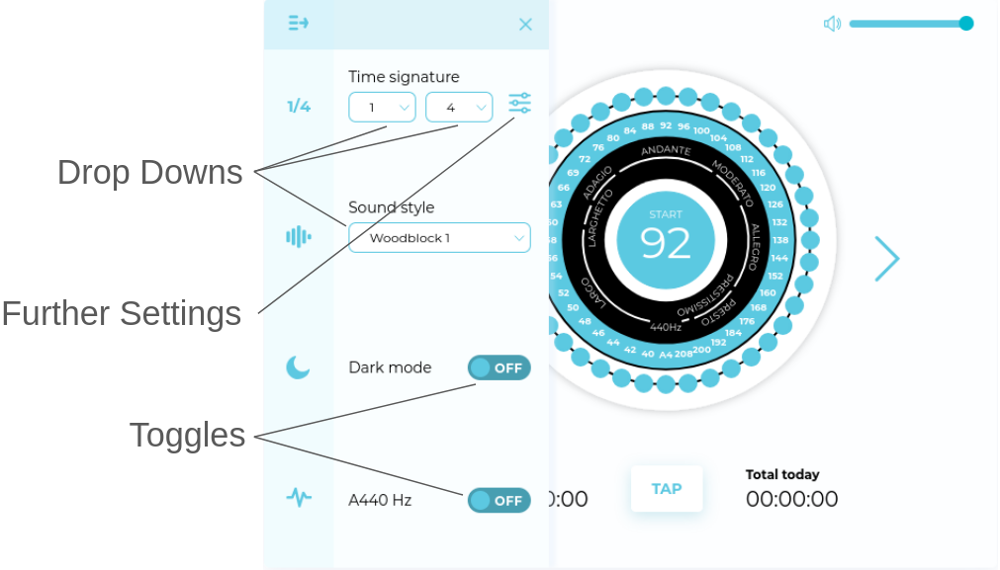
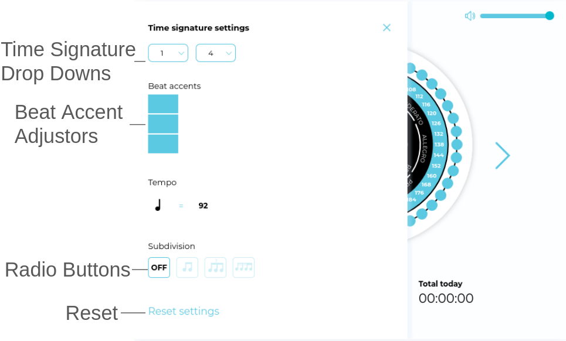

%%
#Incomplete
#Home
%%
## Contents

- [Introduction](Metronome%20and%20Practice%20Tracker.md#Introduction)
- [Analysis](#Analysis)
	- [Project Definition](Analysis.md#Project%20Definition)
	- [Stakeholders](Metronome%20and%20Practice%20Tracker.md#Stakeholders)
	- [Research](Metronome%20and%20Practice%20Tracker.md#Research)
	- [Features](#Features)
	- [Limitations](#Limitations)
	- [Computational Methods](#Computational%20Methods)
	- [Hardware and Software Requirements](#Hardware%20and%20Software%20Requirements)
	- [Success Criteria](#Success%20Criteria)
- [Design](#Design)
	- [Structure Diagram](#Structure%20Diagram)
	- [Algorithms](#Algorithms)
	- [Data Structures](#Data%20Structures)
	- [Validation of Inputs](#Validation%20of%20Inputs)
	- [Identify Test Data](#Identify%20Test%20Data)
	- Identify Further Test Data
- [[]]
	- Iteration One
	- Iteration Two
	- Iteration Three
	- Iteration Four
	- Iteration Five
	- Iteration Six
- Evaluation
	- Testing
	- Success Criteria Checks
	- Usability Checks
	- Limitation and Improvement Checks

# Analysis
## Introduction

>written from a final perspective at the end

## Project Definition

In the study, teaching, and performance of music the ability to practice effectively and efficiently is vital to success. A tool used for centuries is the metronome, a simple tool to create a consistent beat at a variable tempo. As well as this, one of the best ways to accelerate progress in practice is to use a practice log, a tool well renowned for its effectiveness throughout learning which helps learners keep a consistent track of what has been achieved, how it has been achieved, and where to improve next.  

I believe that to make musical practice more effective these tools should both be accessible together in a convenient location since they are both used within the same context, practice. 

My program will enable the user to set up a metronome to their requirements and be able to use this to aid their practice as they need it to, since this is not necessarily the same for all musicians (e.g. many jazz musicians will practice with the metronome only on two and four). It should also enable the user to write practice logs in a practical and structured manner, allowing them to record information effectively and quickly. Ideally it should also allow video or audio recordings to self-reflect on tone and technique.

## Stakeholders

Three stakeholders have been identified for the project: musicians, music students, and music teachers. 

### Musicians  

Musicians will often perform in many contexts, such as for gigs, auditions, etc. Joubert (2023) tells us that the ability to keep tempo is vital for performance and to play as the composer intended. Furthermore, the use of practice logs helps to record what has been practiced, allowing you to cover a lot of material in a short period of time without losing track. It also allows musicians to reflect in their practice time and if it is being used effectively (Dorman, 2016). 

### Music Students 

Music students will have to learn pieces as assignments that push their abilities to improve their musical abilities. The use of a metronome is essential in learning difficult passages. A common technique among musicians at all levels is to practice at a slow speed until perfection, and then to slowly build up to the desired tempo (Duffy, 2024). The use of practice logs has been found to be useful throughout education. A study on Spanish speakers learning English found that practice logs have significant benefits to students. Feedback from tutors on their records was found to be constructive on their learning outside of lesson and helped improve the organisation of their time. The ability to reflect on learning also improved student attitude to learning as they have a physical track of their progress (Litzler, 2014). I believe very similar is achievable in music. 

### Music Teachers 

Music teachers will often use metronomes to aid teaching, especially with beginners. Several methods have been identified by Lewis (1996) such as clapping to a metronome at various tempos to build a sense of rhythm within students. The use of logs can help teachers identify difficulties in student practice that might not be obvious within lesson. The ability to accurately see improvement helps teachers plan lessons effectively (Litzler, 2014).

## Research

#### Existing Systems

##### Metronome Online


>Metronome Online

Metronome online is accessed via a web browser as a website ([https://www.metronomeonline.com/](https://www.metronomeonline.com/) Accessed at 2024/06/27). The metronome is presented as a circle where different BPMs are selected by clicking on labelled buttons around the circle. The start/stop button is prominent in the centre and shows the currently selected BPM. It also includes the Italian names for tempo. The two large arrows at the side allow for fine tuning of the tempo in increments of one BPM. Underneath the main UI is a timer for how long the metronome has run, a tap button to allow the desired metronome to be tapped in by the user, and a second timer for how long the metronome has run in total that day. Above is a small volume slider. To the left is a menu. Upon expansion (see below) the menu shows a variety of customisation options. These allow for variation in time signature, Sound style, Dark/Light mode, and to play an A at 440hz for tuning.


>Metronome Online Customisation Menu

The expanded menu allows for greater customisation, which is not an immediate necessity, unlike the other options shown in the main menu. The time signature has two drop downs to select the number of beats and the division of said beats. There is also a further settings menu next to this. The sound style also has a drop down to select the various sound options. The dark mode and tuner are toggled by simple switches.


>Metronome Online Time Sig. Customisation Menu

The time signature settings show the same drop downs as one the previous menu. It also allows adjustment to the accent on each beat from four levels (zero to three). It shows the tempo below. It also allows for different subdivisions of time to be played each beat. It allows for no subdivision, duplets, triplets, and quintuplets. There is also a reset button

##### Google Metronome
 

>Google Metronome

 The google metronome is accessed directly from the browser by searching for metronome. It very simply has a text box to display the current BPM, a start/stop button, and a slider to select the BPM. The drop down below links to other tools like this made by Google and is not relevant to the tool itself. The colour of the UI changes with higher and lower BPMs varying from colder colours to warmer colours.


>Google Metronome Cold


>Google Metronome Warm

##### Metronome Beats


>Metronome Beats

Metronome Beats is an android app developed for use on mobile devices. It features two modes, a metronome and a drum machine. For this project, the metronome will be the focus of analysis.

The side menu features links to other apps by the same developer as well as premium features which have no impact on the metronomes use, so it will be ignored. The mode select allows for switching between the two different modes. While it may appear there are five modes, the middle button is a simplified drum machine, the generates poly-rhythms on the drum machine and does not open a separate page, and the last button prompts the user to purchase premium features; so for practical usage, there are only two modes.

The lights indicate which beat the metronome is currently on by turning on and off. The first beat is coloured differently for emphasis.

The sliding indicator moves linearly back and forth, returning to the start every other beat.

The increment and decrement buttons can adjust the BPM by one and five. The BPM display can also be used to adjust the BPM by scrolling it. The BPM slider can also be used to adjust the BPM. It also features a written tempo written above it, which changes based on the range the current BPM is within.

The beats/bar button opens a popup menu to change the amount of beats in each bar from one to sixteen. The clicks/beats button opens a popup menu to change the amount of click sounded per beats from one to sixteen. The tap tempo button adjusts the tempo to how often it is being pressed by the user.

The start/stop button is used to start and stop the metronome. The tempo trainer opens a separate screen to add a count in, increase and decrease tempo after a certain amount of time has passed, and add mute bars. the timer button opens a separate screen to add a count in, and stop the metronome after either a certain amount of bars, or a certain amount of time. It also allows the amount of time elapsed to be shown, but is off by default.

##### Musicalog


>Musicalog

The home page features two sections, one to show current goals (of which there are none by default), and one to show the progress of total time spent practising. There is a button to buy premium which will be ignored, as well as a button to start a new practice session. There is also a section at the bottom to switch between four pages, home, log, view, and options.

The log page shows a large button to start a practice session along with a smaller button to add previous practice sessions.

 
>Musicalog log page

When practice is started a stopwatch begins counting. At the bottom there is a pause button along with a button to end practice. There is also a button to create an archive. Archives are used to record audio.


>Musicalog Timer

Once the finish button is pressed a screen to save details about the practice log is opened. There are text fields to record instrument, date, time spent, as well as any notes. The instrument field can auto-fill common instrument names as well as changing the eighth note icon to match.


>Musicalog Save Session

On the view page previous practice sessions can be viewed and filtered by date and instrument. The total practice time progress tab is reused from the home page.

There are several possible behaviours for the timer during sessions, which are selectable from the options page. By default it will check if any practice goals are active. If none are found it will use progress within an hour. Progress within hour will cycle between zero percent to one hundred percent every hour e.g. at three hours forty five mins it will show seventy five because it is currently three quarters through the current hour. If at least one goal is set, then it will switch to goal progress.  Goal progress shows progress towards a set goal. e.g. if goal was twenty hours in a month and you had done ten so far it will show fifty percent. Progress within hour and Goal progress can both be set to be the default option. The final setting is Progress to fixed time which will show how close a session is to reaching a specified time. e.g. if time set was one hour and it had been fifteen minutes it would show twenty five percent. 

Logs can be imported and exported as CSV files as well as be completely wiped. Archives can also be exported or imported via CSV. 

##### Common Metronome Features

- set bpm

- start stop button

- tap bpm

- time signature

- customise sounds

- subdivisions

- customise appearance

- skip beats

##### Common features practice logs 

- timers

- goals

- review sessions

- record bits from sessions 

- stats

#### Stakeholder Needs

A google form was sent to stakeholders. It asked what they believe is essential in a metronome/practice tracker, and what is nice to have. 

The essentials for a metronome were: keeping track of rhythm 

- making sound 
- changing and showing speed
- range of selectable time signatures
- visual reference e.g. lights

Nice to have features of a metronome included:  

- being able to save presets
- changing the noise made
- beats per second instead of per minute  
- Vibration
- emphasis on certain beats
- ability to play over a song  
- list of popular music with their tempos and time signatures  

Essential features of practice log: 

- Date and duration of practice
- Record of what was practiced
- Notes e.g. good and bad parts, what to improve
- Ability to start and stop timer

Nice to have features of practice log: 

- Share option
- Statistics on practice
- Automatically start logging when app is opened
- Streaks (like duolingo)
- Session tags (e.g. scales, classical, etc.) perhaps linked to metronome presets 
- Attach sheet music 
- Instrument played

#### My Ideas and Approach

I agree with the ideas that were suggested by the shareholders. I also think audio recordings should be added, as I think it would be useful for reflecting on tone and intonation. Furthermore, I believe video recording could be added, but would be of less priority. I think this would be helpful in analysing technique

## Features

The features to be added will have an essentiality level assigned. 

High = An essential feature for the app to be successful 

Medium = A feature that would greatly improve the apps usefulness, but not essential e.g. log notes 

Low = A feature that would be useful but not detrimental to the app if not included e.g. attach sheet music 

This is also affected by what stakeholders think is essential and what is useful

| Feature                | Description                                                                                        | Justification | Essentiality level | Source                                        |
| ---------------------- | -------------------------------------------------------------------------------------------------- | ------------- | ------------------ | --------------------------------------------- |
| Start/Stop             | Ability to start and stop the metronome                                                            |               | High               | Existing Systems, Stakeholders, My ideas      |
| Input BPM              | Ability to adjust the BPM of the metronome                                                         |               | High               | Existing Systems, Stakeholders, My ideas      |
| Play SFX               | Make a noise on every beat                                                                         |               | High               | Existing Systems, Stakeholders, My ideas      |
| Visually indicate time | Visual indicator of BPM e.g. lights that change at the current BPM                                 |               | High               | Existing Systems, Stakeholders, My ideas      |
| Input time signature   | Ability to change the length and amount of beats                                                   |               | Medium             | Most Existing Systems, Stakeholders, My ideas |
| Tap BPM                | Ability to set BPM by tapping at the desired speed                                                 |               | Low                | Existing Systems, Stakeholders                |
| Customise Audio        | Ability to change what sound is made by the metronome e.g. beep or click                           |               | Medium             | Existing Systems, Stakeholders, My Ideas      |
| Skip Beats             | The ability for the metronome to only play on certain beats                                        |               | Low                | Existing Systems, My ideas                    |
| Emphasised Beats       | The ability to have certain beats emphasised over others. Likely to be implemented with skip beats |               | Low                | Stakeholders                                  |
| Save presets           | The ability for preset metronome settings to be saved and loaded                                   |               | low                | Stakeholders                                  |
| Haptic Feedback        | The ability to have the metronome vibrate on the beat                                              |               | low                | Stakeholders                                  |
| Start Session          | Ability to make a new practice session                                                             |               | High               | All Existing Systems                          |
| End and save session   | Ability to save a session and finish practice                                                      |               | High               | All Existing Systems                          |
| Date and duration      | Record date and duration of practice                                                               |               | High               | Existing Sytems, Stakeholders, My ideas       |
| Record practice        | Record information about what was practiced e.g. pieces played                                     |               | High               | Existing Systems, Stakeholders, My ideas      |
| Start/Stop timer       | Ability to start and stop practice timer i.e. add breaks in the middle of practice                 |               | High               | Existing Sytems, Stakeholders, My ideas       |
| Share session          | The ability to export a practice session to be shared                                              |               | Low                | Stakeholders                                  |
| Goals                  | The ability for the app to track progress towards user set goals e.g. practice 3 hours this week   |               | Low                | Existing systems                              |
| Statistics             | The ability for statistics on practice to be generated by the system                               |               | Low                | Existing systems, Stakeholders                |
| Streaks                | The ability for the system to track how many days in a row a practice session has taken place      |               | Low                | Stakeholders                                  |
| Customise Appearance   | Ability to change the colour theme of the system                                                   |               | Medium             | My ideas, Existing Systems                    |

## Limitations

There were several proposed features decided not to be feasible to implement which will be summarised here

| Feature                                        | Reason for exclusion                                                                                                                                                                                                                                                          |
| ---------------------------------------------- | ----------------------------------------------------------------------------------------------------------------------------------------------------------------------------------------------------------------------------------------------------------------------------- |
| Beats per second                               | Only wanted by one stakeholder. Would only complicate the program which could impede usefulness                                                                                                                                                                               |
| Attaching sheet music                          | Only wanted by one stakeholder. Would likely require users to provide their own sheet music files.                                                                                                                                                                            |
| Built in list of music and their BPMs          | Would require a large amount of additional research into several genres and would require frequent updating to remain useful.                                                                                                                                                 |
| Automatically start logging when app is opened | May not be the desired function of the app, as users may wish to just review practice sessions rather than start practising, so this shouldn't be forced as the default. They may also only want to use the metronome and not use any of the practice tracking functionality. |

## Computational Methods

This project is suitable for being solved computationally for several reasons. 

A metronome requires precise timing and works via logical steps to achieve its intended goal of keeping a consistent, user defined beats. These are both properties very well suited to computers, which follow logical steps and act very precisely. 

Practice logs require the ability to store and retrieve data, and for the implementation in this project it also needs to keep track of time and calculate statistics. Computers are able to store and retrieve data quickly and accurately, as well as perform complex calculations quickly. 

Furthermore, a computers ability to perform tasks concurrently would allow the practice log and metronome to be used at the same time, making this solution very versatile in its use.

## Hardware and Software Requirements

#### Development

##### Hardware

- Personal Computer - Required to use android studio
- Keyboard and Mouse - Required to interact with android studio
- Monitor - Required to use android studio

##### Software

- Android studio - Primary IDE used for android development made by intelliJ and supported by Google (the developers of android). Android will be the targeted OS for the solution. Has a built in android emulator which can be used for testing, as well as the ability to connect to external android devices for debugging via ADB
#### Deployment

##### Hardware

This will run on handheld mobile smart devices - Convenient for the use of metronomes and practice tracking as it is almost always available
##### Software

Android OS - Easily accessible OS used by the majority of smartphones with a well documented platform for development via android studio and compose.

## Success Criteria

| No. | Criteria                                                                                | Justification                                                                                                                                                                                                                                     |
| --- | --------------------------------------------------------------------------------------- | ------------------------------------------------------------------------------------------------------------------------------------------------------------------------------------------------------------------------------------------------- |
| 1   | Allow the user to start and stop the metronome.                                         | The metronome must be able to stop if it is to faithfully be used like its real life counterpart.                                                                                                                                                 |
| 2   | Allow the user to update the BPM to a range of different values between 1BPM and 300BPM | Being able to practice pieces at/of different tempos requires the user to be able to change the tempo.                                                                                                                                            |
| 3   | Show the user a visual and audio representation of the metronome ticking                | To practice with the desired rhythm, the user must be able to experience it via one of the five senses                                                                                                                                            |
| 4   | Allow the user to start, save, and end practice sessions                                | Evaluating and reflecting on practice requires the program to be able create and save practice sessions                                                                                                                                           |
| 5   | Store the date and time of practice sessions                                            | Will allow for a criteria for practice sessions to be sorted when presented to the user e.g. Sort by most recent                                                                                                                                  |
| 6   | Allow the user to record information about the quality of practice                      | Reflecting on practice requires user input on the quality of practice, helping to show what they need to work on. This should be quantitative ( e.g. one to five Star ranking) and qualitative ( e.g. two things done well, one thing to work on) |
| 7   | Allow the user to record information about what was practiced                           | Allows for a criteria for practice sessions to be sorted when presented to the user e.g. Sort by piece                                                                                                                                            |
| 8   | Time practice sessions                                                                  | Allows for quantitative data to be collected on practice sessions which can be used for statistics (e.g. time practiced this week) and as a sorting criteria (i.e. sort by time practiced)                                                        |
| 9   | Allow user to pause practice session timer and record breaks                            | Being able to take breaks is important to practice (cite this). Recording this allows for more collection of quantative data                                                                                                                      |
| 10  | Allow the user to review completed practice sessions                                    | Self reflection is important to improvement, hence the user should be able to look back on their practice                                                                                                                                         |
| 11  | Allow the user to share practice sessions                                               | Being able to share progress with peers and teachers aids development, by introducing a new perspective into improvement                                                                                                                          |
# Design

## Structure Diagram

Since this project is made of two main parts, it seemed fitting to create a structure diagram for both.


>Metronome Structure Diagram

Within the presets section, the state of the metronome can be saved and reloaded at a later time. Save Preset would create a record of all current variable values. Load Preset would overwrite all current variables with the values stored in a stored record.

The Start/Stop section handles the main running of the metronome. Each of its components will trigger periodically based on the current BPM, time signature, and skip beats and if the metronome is running. Start/Stop itself is responsible for keeping track if the metronome is running, changing this when appropriate. Update Lights increments which light is active each beat. Play SFX plays a sound effect on each beat. Trigger Haptics vibrates the device on each beat.

The BPM section is responsible for all BPM inputs.

The Time Signature section is responsible for controlling how many beats are played, at what subdivision, and keeping track of what's skipped. Input Time Signature handles the first two of these, as they are both encapsulated by the musical concept of a time signature. This is made of two numbers, a top number which encodes the number of beats per bar, and a bottom number which encodes the subdivision of each beat in a bar. For example 6/8 would mean that each bar of music has six eighth notes. Skip/Emphasise Beats tracks which beats should be played and skipped and provides a method for changing which beats are skipped.


 >Practice Tracker Structure Diagram

Within Start Session there are three sub-sections, which will be used when creating a new practice session. Within Practice Info any information about the session is recorded. Date and Duration will keep record the date the session was made as well as the current value of the timer. Record Practice Info will record any user created notes on the session. End and Save will take all records from the other sub-sections and store them into a data base. The session is then ended and is able to be viewed in the Review Sessions section.

Review Sessions allows for past sessions to be viewed and manipulated. View Session allows all details of a past session to be seen. Share Session allows a session to be exported as a file. Edit Session allows details of a session to be edited after it is finished. Delete Session allows for a session to be removed from the database.

## Algorithms

These are pseudo-code versions of algorithms that will be used to guide development. They will likely change to fit the framework being used, however their main purpose will remain.

### Metronome

```
function StartStop(bool currentState){
	newState = !currentState
	return newState
}
```

```
function InputBPM(int newBPM, int currentBPM){
	if(newBPM >= 300 OR newBPM <= 0){
		return currentBPM
	}
	return newBPM
}
```

The if statement is used to ensure the new value is within range. This is also used for inputting the top time signature number.

```
function InputTimeSignatureTopNum(int newTopNum, int currentTopNum){
	if(0 >= newTopNum OR newTopNum >= 21){
		return currentTopNum
	}
	return NewTopNum
}
```

```
function InputTimeSignatureBottomNum(int newBottomNum, int currentBottomNum){
	if(log(newTopNum,2) % 1 != 0 AND (newBottomNum > 16 OR newBottomNum < 1){
		return currentTopNum
	}
	return newTopNum
}
```

Since the bottom number can only be a power of two (identified in validation of inputs), the log base two is taken. It is then checked for a fractional part by then taking it modulo one, extracting only the fractional part. If there is a fractional part, then the new value cannot have been a power of two, as only powers of two return integers (numbers which lack a fractional part) when the log base two is taken. A range check is also performed.

```
function updateLightsSFXHaptics(int BPM, int topNum, int bottomNum, int activeLight, bool running){
	if(!running) return
	delay((60*BPM)/(bottomNum/4)
	vibrate()
	playSFX()
	return (activeLight+1)%topNum
}
```

An if statement is used such that this function only has effect if the metronome is running.
Then a delay is used (measured in seconds). A conversion has to be made from BPM to seconds. First beats per minute is converted to Minutes per Beats by taking the inverse of the current BPM. Next minutes are converted to seconds by a conversion factor of x60. This is then divided by a quarter of the bottom number (the subdivision). This can simplify to make the subdivision x240 and simply divide by just the subdivision. 

### Practice Tracker

As a database is planned to be used to store practice sessions, SQL commands to create, read, update, and delete were written. These SQL commands allowed for searching, updating and deleting by id and by date.

```sqlite
CREATE TABLE IF NOT EXISTS sessions (
	id   INTEGER PRIMARY KEY AUTOINCREMENT,
	date TEXT    NOT NULL,
	info TEXT    NOT NULL
)
```

```sqlite
INSERT INTO sessions (date, info)
VALUE(givenDate, givenInfo)
```

```sqlite
SELECT * FROM sessions
```

```sqlite
SELECT date, info FROM sessions
```

```sqlite
SELECT date, info FROM sessions
WHERE id LIKE targetId
```

```sqlite
SELECT date, info FROM sessions
WHERE date LIKE targetDate
```

```sqlite
UPDATE sessions
SET date = newDate
WHERE date LIKE targetDate
```

```sqlite
UPDATE sessions
SET   date = newDate
WHERE id   LIKE targetId
```

```sqlite
UPDATE sessions
SET   info = newInfo
WHERE date LIKE targetDate
```

```sqlite
UPDATE sessions
SET   info = newInfo
WHERE id   LIKE targetId
```

```sqlite
DELETE FROM sessions
WHERE id like targetId
```

```sqlite
DELETE FROM sessions
WHERE date like targetDate
```

## Data Structures

Both halves of the solution will make use of appropriate data structures to ensure data is stored and retrieved in an effective and intuitive manner.

Within the metronome most data can be stored as simple variables.

| Name        | Type    | Description                                                               | Justification                                                                                                                                                            |
| ----------- | ------- | ------------------------------------------------------------------------- | ------------------------------------------------------------------------------------------------------------------------------------------------------------------------ |
| activeLight | Integer | holds the index of the currently active light                             | indexes are always integers                                                                                                                                              |
| currentBPM  | Integer | holds the current BPM of the metronome                                    | BPM is always an integer                                                                                                                                                 |
| active      | Boolean | false when the metronome is not running, true if the metronome is running | The metronome can only be in two state, running or not running, so a boolean which can only be two values is most appropriate                                            |
| beats       | Integer | holds the amount of beats per bar (the top number of the time signature)  | Whilst non-integers are used in time signatures, it is exceedingly rare and can always be converted to a time signature with integers, so an integer is most appropriate |
| subdivision | Integer | holds the subdivision of each beat (the bottom number of the metronome)   | Whilst non-integers are used in time signatures, it is exceedingly rare and can always be converted to a time signature with integers, so an integer is most appropriate |
For some data it is more appropriate for them to be stored within larger data structures

| Name       | Type         | Description                                                                                                                                  | Justification                                                                                                                                                                                                                                           |
| ---------- | ------------ | -------------------------------------------------------------------------------------------------------------------------------------------- | ------------------------------------------------------------------------------------------------------------------------------------------------------------------------------------------------------------------------------------------------------- |
| trackSkips | boolean list | each index corresponds to a light. If the value of that index is false that light should be skipped. Otherwise it should be treated normally | As there are several lights that need to be tracked, the number of which can be changed at any time, a list was deemed best as it is dynamic. It was determined booleans were best as a light can only be in one of two states, skipped or not skipped. |

For the practice tracker it was expected data structures would generally be more complex, as operations involving databases are planned. 

A simple database diagram was made only involving one table


>sessions table diagram

This table would simply hold all completed practice sessions, which would be given a unique id. They would also hold a date and info about the practice session itself. 

To access the database SQL would be used. The commands to facilitate this can be found in the algorithms section.

When loaded from the database into the program it was decided they would be best stored as a data class with fields for each of the fields in the sessions table.


>session class diagram

## Validation of Inputs

Not all inputs will be discussed, for example if there is one very similar already discussed

### Metronome

| Function             | Input/s                   | Format           | Input Method                  | Range                                       | Justification                                                              |
| -------------------- | ------------------------- | ---------------- | ----------------------------- | ------------------------------------------- | -------------------------------------------------------------------------- |
| Input BPM            | BPM                       | Integer          | Inc/Decrement Buttons, Slider | 1<=x<=300                                   | Vast majority of music's BPM is within this range                          |
| Input Time signature | Top Number, Bottom Number | Integer, Integer | Sliders                       | 1<=x<=20, 1<=x<=16 where x is a power of 2. | Majority of music is within this range, Bottom number must be a power of 2 |
| Start/Stop           | isRunning                 | Boolean          | Toggleable button             | True,False                                  | There are only two valid states for any metronome, running or not running  |

### Practice Tracker

| Function             | Input/s | Format | Input Method | Range | Justification                                                                                                 |
| -------------------- | ------- | ------ | ------------ | ----- | ------------------------------------------------------------------------------------------------------------- |
| Record Practice Info | info    | string | Text field   | N/A   | User should be able to enter any characters they see fit, as long as it is understandable and useful to them. |

## Identify Test Data

### Milestones

- Create the metronome interface
- Start and Stop the Metronome
- Change the BPM
- Change time signature
- Add skip beats
- Change between metronome and practice tracker screen
- Display list of past practice sessions
- Start new practice session
- Save, load, and delete sessions


## Tests

### Milestone 2: Start and Stop the Metronome

| Test Number | What is being tested and inputs                                                                                        | Expected output                                                                                                                           |
| ----------- | ---------------------------------------------------------------------------------------------------------------------- | ----------------------------------------------------------------------------------------------------------------------------------------- |
| 1           | The start stop button changes the state of the metronome from running to not running and vice versa. Test: true, false | When the running state is 'false' it will change to 'true' upon use. When the running state is 'true' it will change to 'false' upon use. |
| 2           | The start stop button changes appearance based on if the metronome is currently running. Test: true, false             | When the running state is 'false' it will display a play icon. When the running state is 'true' it will display a pause icon.             |
| 3           | The light stored as the currently active light is displayed as lit. Test: -1, 0, 3, 4, H                               | A number from 0-3 is accepted (default amount of lights is 4). All other inputs rejected                                                  |
| 4           | The currently active light is correctly incremented.                                                                   | The next light is lit as the current becomes unlit. This rolls around to the start if the final light is reached.                         |
| 5           | The lights are updated at a constant interval based on the current BPM. Test: 0, 60, 300, 301, 350, H                  | Lights update at a rate inversely proportional to the current BPM. Numbers from 1-300 are used, any others rejected.                      |
### Milestone 3: Changing BPM

| Test Number | What is being tested and inputs                                                       | Expected output                                                                                                                                                                                 |
| ----------- | ------------------------------------------------------------------------------------- | ----------------------------------------------------------------------------------------------------------------------------------------------------------------------------------------------- |
| 1           | BPM can be incremented and decremented from various values. Test: -1, 0, 60, 300, 301 | BPM is incremented and decremented from valid values (1-300). It does not increment or decrement to invalid inputs. If the initial value is invalid it is corrected to the closest valid value. |
| 2           | BPM can be updated using a slider.                                                    | BPM updates to match the position of the slider. This also works in reverse, with the slider position updating to the BPM if it updates via other means.                                        |
### Milestone 4: Changing Time Signature

| Test Number | What is being tested and inputs                                                | Expected output                                                                                               |
| ----------- | ------------------------------------------------------------------------------ | ------------------------------------------------------------------------------------------------------------- |
| 1           | Number of lights updates to match the current number of beats (the top number) | Number of lights equals top number within valid values                                                        |
| 2           | Speed of beats updates to match current subdivision.                           | speed of beats is  proportional to the subdivision i.e. a doubling in subdivision causes a doubling in speed. |
### Milestone 5: Adding skip beats

| Test Number | What is being tested and inputs | Expected output                                                                                 |
| ----------- | ------------------------------- | ----------------------------------------------------------------------------------------------- |
| 1           | Beats can be toggled on and off | Beats which are toggled off are always treated as inactive. Otherwise they are treated normally |
### Milestone 6: Starting a new practice session

| Test Number | What is being tested and inputs                                               | Expected output                                                                                         |
| ----------- | ----------------------------------------------------------------------------- | ------------------------------------------------------------------------------------------------------- |
| 1           | A new practice session can be started                                         | An interface is generated with all necessary components of the practice tracker                         |
| 2           | A timer is used to track the length of the practice session and can be paused | A time starts and counts correctly at the correct speed. It pauses and plays when requested by the user |
| 3           | The date and time is recorded automatically                                   | The date and time of the session are retrieved and displayed correct with the current time and date.    |
### Milestone 7: Saving, loading, and deleting a session

| Test Number | What is being tested and inputs                                 | Expected output                                                                |
| ----------- | --------------------------------------------------------------- | ------------------------------------------------------------------------------ |
| 1           | Practice sessions are stored into a database correctly          | The database is shown to be storing the sessions with all data intact          |
| 2           | Practice sessions can be recalled from the database into memory | The database is queried and returns the desired session with all relevant data |
| 3           | Practice sessions can be deleted                                | The desired session is deleted from the database                               |


# Development


